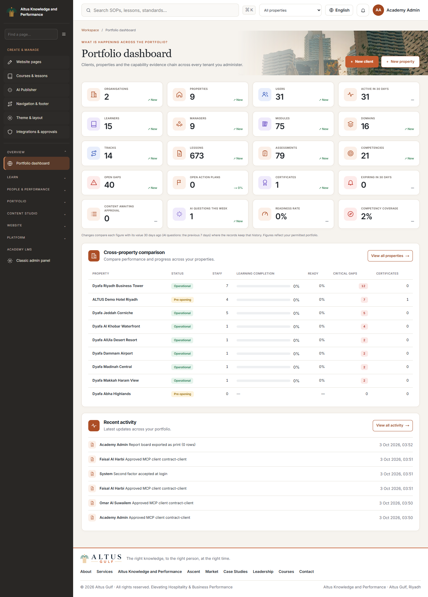
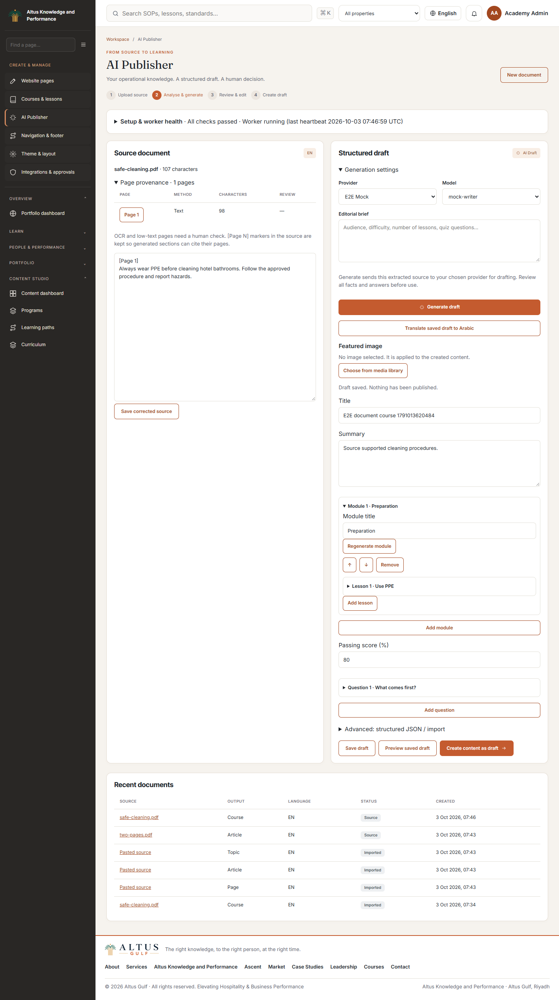
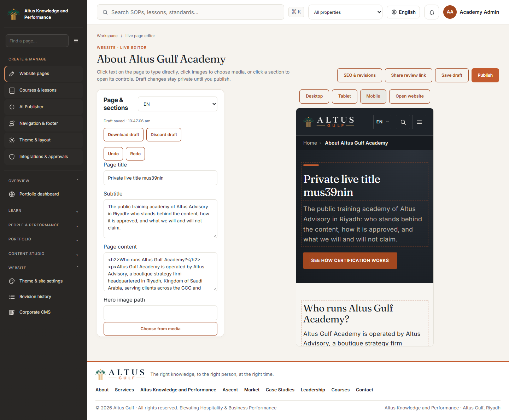
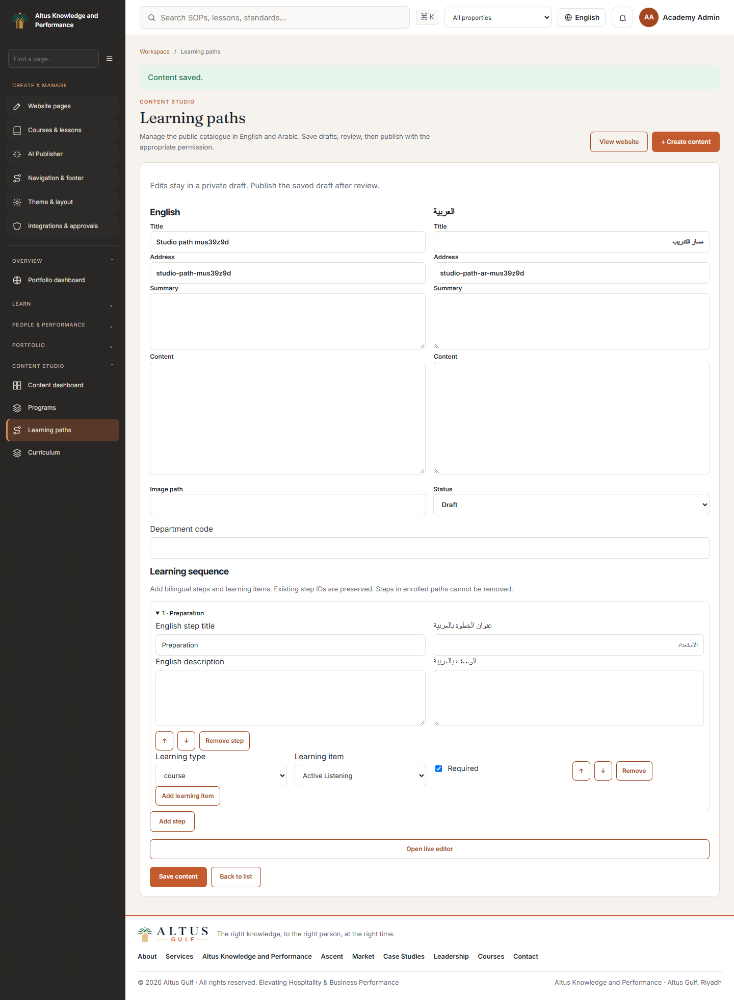
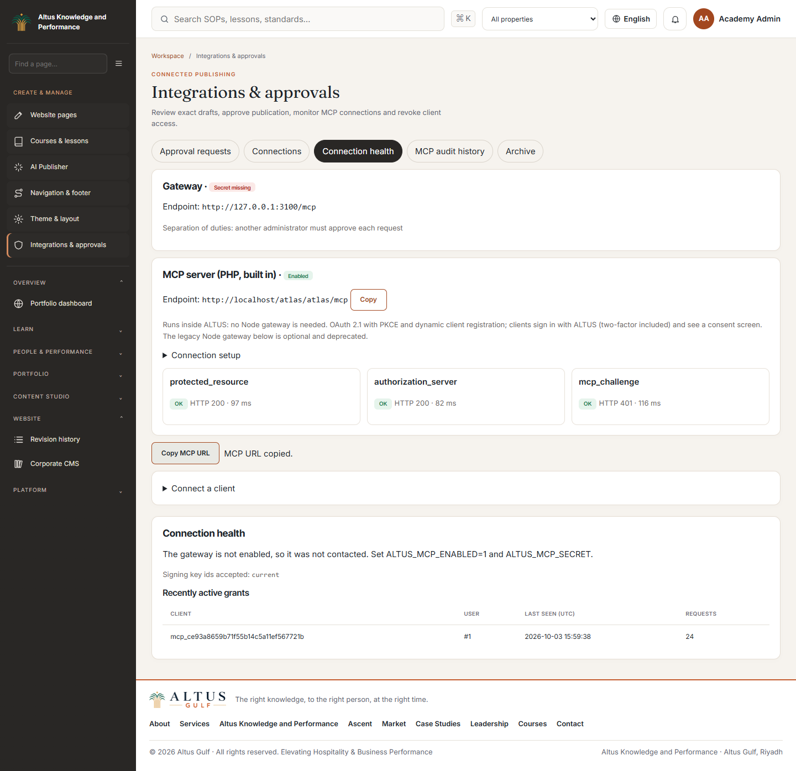

# ALTUS admin guide

Sign in at `/login`, then open `/hkp/admin`. Use the four primary sidebar entries: **Website Pages**, **Courses & lessons**, **AI Publisher** and **Navigation & footer**. Search the sidebar or press Ctrl+K/Cmd+K to find other tools. On phones, open the menu drawer; Arabic uses RTL. Permissions control the available tools.

## Create content from a document

1. Open **AI Publisher** (`/hkp/cms/publisher`). Check **Setup & worker health**; each missing dependency has a setup action.
2. Upload PDF/DOCX/PPTX/TXT/MD/JSON or paste text. Select course, website page, article, hospitality topic or SOP, and EN/AR. Click **Analyse document**.
3. Uploads wait for the extraction worker. Follow progress; cancel if needed. A failed job gives the cause and **Retry extraction** where permitted. Text and scanned PDF pages are processed locally, with English/Arabic OCR where required.
4. Read the source and per-page provenance. Correct text and **Save corrected source** before generation. Review OCR-marked pages carefully.
5. Select an enabled provider and its model, enter an optional brief, then **Generate draft**. Generation uses the selected configured service.
6. Compare output with the source. Edit and reorder modules, lessons, objectives, sections, quiz options, correct answers and pass mark. Review source-page references. **Regenerate** replaces the selected item; **Translate saved draft** creates an independent language draft.
7. Choose a featured image using the media library/upload controls. **Save draft**, then **Preview saved draft**.
8. **Create content as draft** writes real native records. Course packages include modules, lessons and quizzes. Open the linked native builder and finish translations/media/review. Nothing is published by package import.
9. For SOPs choose the reviewer and approver and submit to **internal review**. Complete the existing knowledge approval workflow before publication.

## Edit the actual frontend

An authorized administrator sees **Edit page** on supported public pages. Choose **Live editor**, or open a page from **Website Pages**. Click supported text directly in the preview to type and synchronize the adjacent controls. Clicking an image opens its media control; keyboard Enter/Space is supported. Entity detail pages use their native live content editor.

1. Select EN/AR and edit title, summary/body, hero image or call to action. Home also exposes corporate content blocks.
2. Insert any of the thirteen section types. Expand fields or click the section in the preview. Duplicate, hide/show, reorder with arrows/drag, or remove. Use media selection/upload for images.
3. Changes save privately. Use **Save draft** to save now; undo/redo tracks editor changes. Desktop/tablet/mobile buttons adjust preview width.
4. Check both languages and click **Publish** when ready. Visitors see only published records; signing into a preview does not publish it.

If another editor changes the content, a conflict prevents overwriting it. Download the draft where offered, reload/discard the stale private draft, and reapply reviewed changes. Page **SEO & revisions** and **Revision history** (`/hkp/studio/revisions`) provide recovery. Restoring a Studio revision creates a private draft that needs publication. Review links expire and require editor login.

Catalogues, contact forms, certificate verification and learning actions remain functional inside their surrounding editable content. The editor modifies supported content records and sections, rather than application code.

## Courses and resource CRUD

**Courses & lessons** opens the existing native builder for course metadata, ordered sections/lessons, bilingual lesson text, media/resources and completion rules. **Assessments & question bank** manages quizzes/options/pass marks. Use existing publication controls after review. Governed PDF-library courses retain source review/release controls. Removal respects native learner-history protections.

**Programs, Articles, Hospitality topics and Learning paths** provide bilingual create/edit forms and live metadata editing. Drafts stay private. Programs/topics select ordered courses. Paths add stable steps and course/program/SOP/assessment/skill items; enrolled steps cannot be removed destructively.

## Theme, global settings and menus

**Theme & site settings** (`/hkp/cms/theme`) manages approved fonts, colours, spacing, logo, site name, SEO defaults, contact details and header/footer/navigation appearance. Save privately, inspect the actual site preview, then **Publish saved draft**.

**Navigation & footer** selects a header/footer menu. Edit English/Arabic labels, addresses and visibility; add links and reorder using drag or Alt+arrow. **Save private draft** changes only the preview. **Publish saved draft** updates visitors' menus. Required system URLs are protected. Footer groups remain Learn, Resources and Company.

| Public destination | Landing route |
|---|---|
| Home | `/en` |
| Courses / Programs / Learning paths / Certifications | `/en/courses`, `/en/programs`, `/en/learning-paths`, `/en/certificates` |
| SOP resources / Hospitality topics / Articles / Verify | `/en/sop`, `/en/hospitality-topics`, `/en/articles`, `/en/verify` |
| About / For Hotels / Contact / Photo credits | `/en/about`, `/en/hotels`, `/en/contact`, `/en/credits` |

All have Arabic equivalents. Landing pages are in Website Pages; individual resource/course details are in their respective native editors.

## Connect and manage MCP

1. Complete the [gateway setup](MCP_GATEWAY_RUNBOOK.md), including client registration and matching native/gateway configuration.
2. Open **Integrations ? Connection health** (`/hkp/cms/integrations?tab=health`); gateway, resource metadata and OAuth metadata should pass.
3. Add the displayed gateway `/mcp` URL to your compatible client. Start OAuth, sign into ALTUS (including 2FA if enabled), review the requested scopes and consent.
4. Inspect **Connections** to confirm the client/user, last request and activity. Revoke access here when required.
5. The client saves private drafts and requests publication. Another administrator reviews **Approval requests**, checks preview/diff and approves the exact version. The client then uses its approved operation once within ten minutes.
6. Use **Audit history** to trace the returned audit reference. **Archive** can restore archived pages into drafts; normal publication review applies.

See [MCP administrator workflows](MCP_ADMIN_WORKFLOWS.md) for approvals, revocation and recovery.

## Troubleshooting

| Symptom | Action |
|---|---|
| Missing tables/editor unavailable | Verify database override, back up and run `php index.php ha_cli migrate`. |
| Document remains queued | Start `publisher_cli daemon` or schedule `publisher_cli work 25`; inspect the heartbeat. |
| OCR/dependency failure | Follow **Setup & worker health**; configure Python/Tesseract and both eng/ara language files. |
| No provider/model | Configure/enable a chat provider and synchronize models in AI Studio. |
| Invalid AI output | Refine the brief or correct the validated draft manually; import has not occurred. |
| Conflict | Reload current content and merge reviewed changes; do not keep retrying stale versions. |
| Guest sees old content | Save is private; publish the reviewed draft and verify EN/AR/visibility. |
| Missing tool / 403 | Check current role permissions and tenant scope. |
| MCP connection fails | Check all three health probes, exact URLs/secrets/key ids, client redirect URI and resource audience. |
| Approval expired/content changed | Request a new approval and review the current version. |

Screenshots use local test fixtures. Deployment-specific checks and executed results are recorded in the [acceptance report](../ALTUS_AI_PUBLISHER_ACCEPTANCE_REPORT.md).
